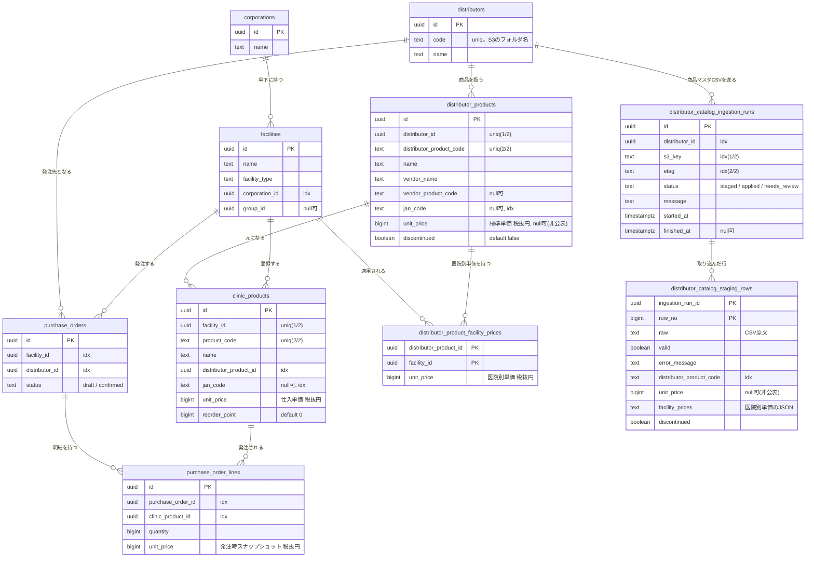

# データベーススキーマ（現状）

このドキュメントは、現時点で稼働しているPostgreSQLスキーマを書き起こしたもの。

- スキーマは**マイグレーションファイルではなく、gormの`AutoMigrate`**で生成している。
  定義元は各コンテキストの `backend/internal/infrastructure/*/model.go`（gormタグ付き構造体）と、
  生成対象の並びを決める `backend/cmd/api/main.go` の `AutoMigrate(...)`。
- `AutoMigrate` は「モデルに合わせて列・indexを足す」だけで、列の削除・リネーム・型変更・変更履歴は残らない。
  本番運用や変更履歴の管理が必要になった段階で golang-migrate 等への切り替えを検討する。
- ドメイン層（`domain/*`）は業務ルール・不変条件を表し、DBの列名・型・indexはこのモデル側が持つ（役割分離）。

最終確認日: 2026-08-14

---

## ER図

> 線は業務上の参照関係を示す。ただし後述のとおり、DB上に**外部キー制約は張っていない**（参照整合はアプリ側で担保）。

---

## テーブル定義

### corporations（法人）
| 列 | 型 | NULL | 既定 | 備考 |
|---|---|---|---|---|
| id | uuid | NO | | PK |
| name | text | NO | | |

### facilities（クリニック）
| 列 | 型 | NULL | 既定 | 備考 |
|---|---|---|---|---|
| id | uuid | NO | | PK |
| name | text | NO | | |
| facility_type | text | NO | | `medical` / `dental` / `vet` |
| corporation_id | uuid | NO | | index |
| group_id | uuid | YES | | グループは未実装のためnull可 |

### distributors（卸業者）
| 列 | 型 | NULL | 既定 | 備考 |
|---|---|---|---|---|
| id | uuid | NO | | PK |
| code | text | NO | | UNIQUE。卸コード。S3のフォルダ名（`orders/{code}/`, `catalogs/{code}/`）に使う。小文字英数字とハイフンのみ |
| name | text | NO | | |

### distributor_products（卸商品）
| 列 | 型 | NULL | 既定 | 備考 |
|---|---|---|---|---|
| id | uuid | NO | | PK |
| distributor_id | uuid | NO | | UNIQUE `(distributor_id, distributor_product_code)` |
| distributor_product_code | text | NO | | 同上UNIQUE |
| name | text | NO | | |
| vendor_name | text | NO | | メーカー名 |
| vendor_product_code | text | YES | | 任意 |
| jan_code | text | YES | | 任意, index |
| unit_price | bigint | YES | | 標準単価（税抜・円）。その卸の定価。**NULLは「卸が単価を公表していない」**（0円と区別する） |
| discontinued | boolean | NO | false | 廃盤フラグ（物理削除しない） |

### distributor_product_facility_prices（医院別単価）
医院ごとに単価を決めている卸の単価。同一性が(卸商品, クリニック)で決まるため、この2列が複合主キー。

| 列 | 型 | NULL | 既定 | 備考 |
|---|---|---|---|---|
| distributor_product_id | uuid | NO | | PK(1/2) |
| facility_id | uuid | NO | | PK(2/2) |
| unit_price | bigint | NO | | 医院別単価（税抜・円） |

### distributor_catalog_ingestion_runs（商品マスタCSVの取り込み履歴）
S3オブジェクト1件の取り込み1回分。設計は別リポジトリ`clinic-inventory-csv-functions`の`docs/distributor-catalog-import.md`。

| 列 | 型 | NULL | 既定 | 備考 |
|---|---|---|---|---|
| id | uuid | NO | | PK |
| distributor_id | uuid | NO | | index |
| s3_key | text | NO | | index `(s3_key, etag)` |
| etag | text | YES | | 同上index。S3オブジェクトの内容から決まるため、同じキー+同じETagは取り込み済みと判定できる |
| status | text | NO | | `staged`(中間表現に変換済・未反映) / `applied`(反映済) / `needs_review`(要確認), index |
| message | text | YES | | 要確認になった理由 |
| started_at | timestamptz | NO | | |
| finished_at | timestamptz | YES | | |

### distributor_catalog_staging_rows（取り込みの中間表現・ステージング）
CSV1行を卸ごとの形式差を取り除いて正規化したもの。反映前にここへ溜め、内容を確認・反映できるようにする。

| 列 | 型 | NULL | 既定 | 備考 |
|---|---|---|---|---|
| ingestion_run_id | uuid | NO | | PK(1/2) |
| row_no | bigint | NO | | PK(2/2)。CSV上の行番号（ヘッダを1行目とする） |
| raw | text | YES | | CSVの原文。突合に失敗した行を人が追うために残す |
| valid | boolean | NO | | 読み取れた行か |
| error_message | text | YES | | 読み取れなかった理由 |
| distributor_product_code | text | YES | | index |
| name / vendor_name / vendor_product_code / jan_code | text | YES | | 正規化後の値 |
| unit_price | bigint | YES | | NULLは単価非公表 |
| facility_prices | text | YES | | 医院別単価のJSON配列。1行に可変個ぶら下がる値で、ステージングは一時置き場のため正規化しない |
| discontinued | boolean | NO | false | |

### clinic_products（クリニック商品）
| 列 | 型 | NULL | 既定 | 備考 |
|---|---|---|---|---|
| id | uuid | NO | | PK |
| facility_id | uuid | NO | | UNIQUE `(facility_id, product_code)` |
| product_code | text | NO | | 同上UNIQUE。クリニック独自コード |
| name | text | NO | | |
| distributor_product_id | uuid | NO | | index。元になる卸商品への紐付け（必須） |
| jan_code | text | YES | | 任意, index。バーコード消費の引き当てに使用 |
| unit_price | bigint | NO | 0 | 仕入単価（税抜・円）。卸の標準単価をデフォルト、医院別単価で上書き可 |
| reorder_point | bigint | NO | 0 | 発注点 |

### purchase_orders（発注・親）
| 列 | 型 | NULL | 既定 | 備考 |
|---|---|---|---|---|
| id | uuid | NO | | PK |
| facility_id | uuid | NO | | index |
| distributor_id | uuid | NO | | index。1発注=1卸 |
| status | text | NO | | `draft` / `confirmed` |

### purchase_order_lines（発注明細・子）
| 列 | 型 | NULL | 既定 | 備考 |
|---|---|---|---|---|
| id | uuid | NO | | PK。行の同一性はDB都合（明細自体は値オブジェクト） |
| purchase_order_id | uuid | NO | | index。親発注への紐付け |
| clinic_product_id | uuid | NO | | index |
| quantity | bigint | NO | | 数量（1以上、集約で担保） |
| unit_price | bigint | NO | 0 | 発注時点の単価スナップショット（税抜・円）。マスタ単価が変わっても過去発注は不変 |

---

## 設計メモ

- **一意制約**
  - `distributor_products` … `(distributor_id, distributor_product_code)` で卸内の商品コード重複を防ぐ。
  - `clinic_products` … `(facility_id, product_code)` でクリニック内の商品コード重複を防ぐ。
  - `distributor_product_facility_prices` … `(distributor_product_id, facility_id)` を複合主キーにして、同じ組の二重登録を防ぐ（CSV取り込みのupsertはこのキーの`ON CONFLICT`で解決する）。
  - `distributor_catalog_staging_rows` … `(ingestion_run_id, row_no)` を複合主キーにしている。
  - `distributors` … `code` にUNIQUE。S3のフォルダ名になるため、重複すると別の卸のCSVが同じフォルダに混ざる。

- **`distributors.code` を後から追加したときの手順**
  `AutoMigrate` は列の追加はできるが、既存行への値の投入（データ移行）はできない。NOT NULL + UNIQUE の列を
  既存テーブルに足す場合、空文字のまま一意インデックスを張ろうとして失敗するため、
  「列追加 → 既存行へ値を投入 → NOT NULL 化 → 一意インデックス作成」の順に手作業のSQLで実施した（2026-08-14）。
  - `purchase_orders` … 現状は一意制約なし。発注番号（クリニックごとの連番）は未実装で、IDのUUIDのみで管理している。
    連番採番を入れる段階で `(facility_id, order_no)` のUNIQUE追加を想定。

- **外部キー制約は張っていない**
  gormの`AutoMigrate`はモデルにリレーションタグが無いとFKを生成しない。本プロジェクトは
  関連タグを使わず手動でモデル⇄ドメイン変換する方針のため、DB上のFKは無い。
  参照整合（例: 明細のクリニック商品が実在する／同一クリニック・同一卸か）はユースケース層で検証し、
  発注の親子はリポジトリのトランザクションで原子的に保存している。

- **`reorder_point` / `quantity` が bigint なのはgormの既定**
  Goの`int`（64bit環境）をgormが`bigint`にマッピングするため。ドメイン上は非負の整数。

- **`int` → `bigint`、`string` → `text`、`bool` → `boolean`** の対応もgormの既定マッピングによる。
