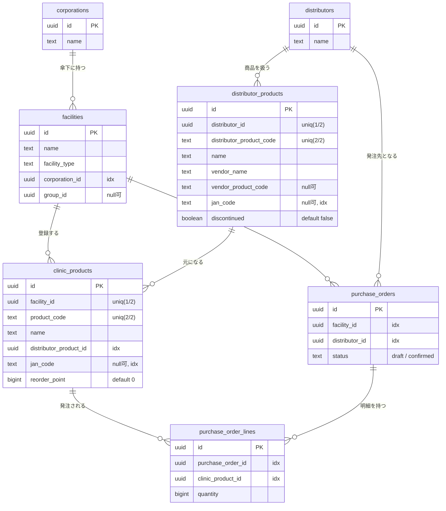

# データベーススキーマ（現状）

このドキュメントは、現時点で稼働しているPostgreSQLスキーマを書き起こしたもの。

- スキーマは**マイグレーションファイルではなく、gormの`AutoMigrate`**で生成している。
  定義元は各コンテキストの `backend/internal/infrastructure/*/model.go`（gormタグ付き構造体）と、
  生成対象の並びを決める `backend/cmd/api/main.go` の `AutoMigrate(...)`。
- `AutoMigrate` は「モデルに合わせて列・indexを足す」だけで、列の削除・リネーム・型変更・変更履歴は残らない。
  本番運用や変更履歴の管理が必要になった段階で golang-migrate 等への切り替えを検討する。
- ドメイン層（`domain/*`）は業務ルール・不変条件を表し、DBの列名・型・indexはこのモデル側が持つ（役割分離）。

最終確認日: 2026-07-20

---

## ER図

> 線は業務上の参照関係を示す。ただし後述のとおり、DB上に**外部キー制約は張っていない**（参照整合はアプリ側で担保）。

---

## テーブル定義

### corporations（法人）
| 列 | 型 | NULL | 既定 | 備考 |
|---|---|---|---|---|
| id | uuid | NO | | PK |
| name | text | NO | | |

### facilities（クリニック）
| 列 | 型 | NULL | 既定 | 備考 |
|---|---|---|---|---|
| id | uuid | NO | | PK |
| name | text | NO | | |
| facility_type | text | NO | | `medical` / `dental` / `vet` |
| corporation_id | uuid | NO | | index |
| group_id | uuid | YES | | グループは未実装のためnull可 |

### distributors（卸業者）
| 列 | 型 | NULL | 既定 | 備考 |
|---|---|---|---|---|
| id | uuid | NO | | PK |
| name | text | NO | | |

### distributor_products（卸商品）
| 列 | 型 | NULL | 既定 | 備考 |
|---|---|---|---|---|
| id | uuid | NO | | PK |
| distributor_id | uuid | NO | | UNIQUE `(distributor_id, distributor_product_code)` |
| distributor_product_code | text | NO | | 同上UNIQUE |
| name | text | NO | | |
| vendor_name | text | NO | | メーカー名 |
| vendor_product_code | text | YES | | 任意 |
| jan_code | text | YES | | 任意, index |
| discontinued | boolean | NO | false | 廃盤フラグ（物理削除しない） |

### clinic_products（クリニック商品）
| 列 | 型 | NULL | 既定 | 備考 |
|---|---|---|---|---|
| id | uuid | NO | | PK |
| facility_id | uuid | NO | | UNIQUE `(facility_id, product_code)` |
| product_code | text | NO | | 同上UNIQUE。クリニック独自コード |
| name | text | NO | | |
| distributor_product_id | uuid | NO | | index。元になる卸商品への紐付け（必須） |
| jan_code | text | YES | | 任意, index。バーコード消費の引き当てに使用 |
| reorder_point | bigint | NO | 0 | 発注点 |

### purchase_orders（発注・親）
| 列 | 型 | NULL | 既定 | 備考 |
|---|---|---|---|---|
| id | uuid | NO | | PK |
| facility_id | uuid | NO | | index |
| distributor_id | uuid | NO | | index。1発注=1卸 |
| status | text | NO | | `draft` / `confirmed` |

### purchase_order_lines（発注明細・子）
| 列 | 型 | NULL | 既定 | 備考 |
|---|---|---|---|---|
| id | uuid | NO | | PK。行の同一性はDB都合（明細自体は値オブジェクト） |
| purchase_order_id | uuid | NO | | index。親発注への紐付け |
| clinic_product_id | uuid | NO | | index |
| quantity | bigint | NO | | 数量（1以上、集約で担保） |

---

## 設計メモ

- **一意制約**
  - `distributor_products` … `(distributor_id, distributor_product_code)` で卸内の商品コード重複を防ぐ。
  - `clinic_products` … `(facility_id, product_code)` でクリニック内の商品コード重複を防ぐ。
  - `purchase_orders` … 現状は一意制約なし。発注番号（クリニックごとの連番）は未実装で、IDのUUIDのみで管理している。
    連番採番を入れる段階で `(facility_id, order_no)` のUNIQUE追加を想定。

- **外部キー制約は張っていない**
  gormの`AutoMigrate`はモデルにリレーションタグが無いとFKを生成しない。本プロジェクトは
  関連タグを使わず手動でモデル⇄ドメイン変換する方針のため、DB上のFKは無い。
  参照整合（例: 明細のクリニック商品が実在する／同一クリニック・同一卸か）はユースケース層で検証し、
  発注の親子はリポジトリのトランザクションで原子的に保存している。

- **`reorder_point` / `quantity` が bigint なのはgormの既定**
  Goの`int`（64bit環境）をgormが`bigint`にマッピングするため。ドメイン上は非負の整数。

- **`int` → `bigint`、`string` → `text`、`bool` → `boolean`** の対応もgormの既定マッピングによる。
